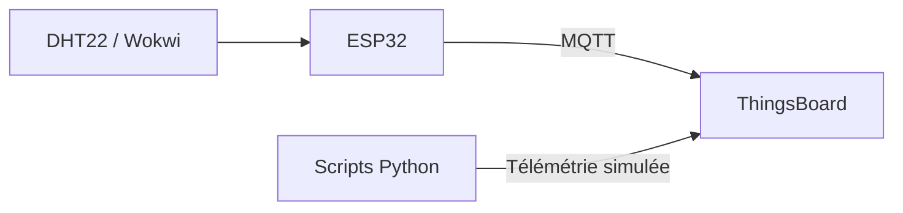

# DHT22 → ThingsBoard — Chaîne IoT de télémétrie

Projet IoT de collecte et de transmission de mesures de température et d’humidité vers **ThingsBoard**. Il peut être exécuté avec un ESP32 simulé dans Wokwi ou entièrement en local grâce à des données simulées générées par Python.

## Fonctionnalités

- Acquisition de température et d’humidité avec un capteur DHT22
- Publication des mesures vers ThingsBoard via MQTT
- Simulation matérielle ESP32 dans Wokwi
- Génération et envoi de données simulées depuis Python
- Séparation des secrets dans un fichier d’exemple non sensible

## Architecture



## Exécution avec les scripts Python

Installez les dépendances puis générez un jeu de mesures :

```bash
pip install -r requirements.txt
python scripts/generate_simulated_dataset.py -n 120
python scripts/send_simulated_data.py --reset
```

## Exécution avec Wokwi

1. Importer le dossier du projet dans Wokwi.
2. Copier `secrets.example.h` vers `secrets.h`.
3. Renseigner les paramètres Wi-Fi et le jeton ThingsBoard dans `secrets.h`.
4. Lancer la simulation.

Le firmware lit les mesures DHT22 et les transmet au serveur MQTT configuré.

## Fichiers clés

| Fichier | Description |
|---|---|
| `sketch.ino` | Firmware ESP32 |
| `diagram.json` | Schéma Wokwi |
| `scripts/` | Génération et envoi de télémétrie simulée |
| `secrets.example.h` | Modèle de configuration, sans secret |

> Ne validez jamais le fichier `secrets.h` ni vos jetons ThingsBoard dans Git.